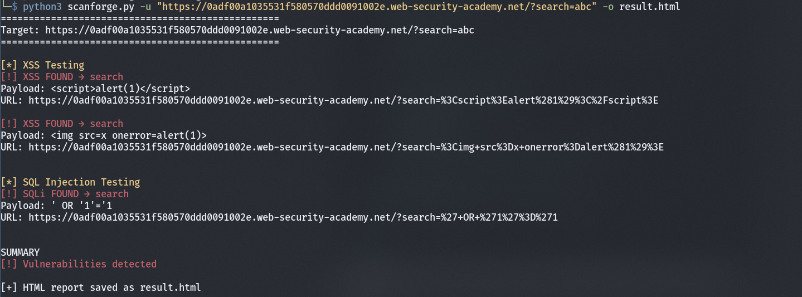
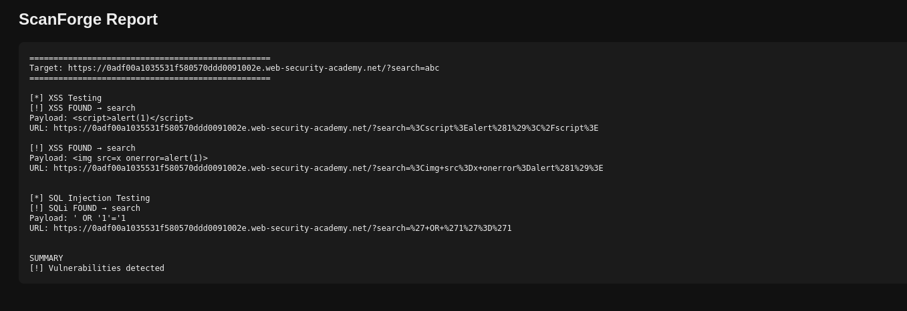

# 🔥 ScanForge - Web Vulnerability Scanner



ScanForge is a lightweight Python-based web vulnerability scanner that detects common security flaws such as **Cross-Site Scripting (XSS)** and **SQL Injection (SQLi)** using automated payload injection and response analysis.

Designed for **learning, labs, and basic security testing**.

---

## 🚀 Features

* Supports **GET parameter testing**
* Detects **XSS via reflection**
* Detects **SQL Injection via response difference**
* CLI support (`-u`, `-f`, `-o`)
* Generates **HTML reports**
* Clean and readable output

---

## ⚙️ Installation

```bash
git clone https://github.com/0xsaurav-exe/ScanForge.git
cd ScanForge
pip install requests
```

---

## ⚡ Quick Start

```bash
python3 scanforge.py -u "http://example.com/page?id=1"
```

---

## 🧪 Usage

### Scan single target

```bash
python3 scanforge.py -u "http://example.com/page?id=1"
```

### Scan multiple targets

```bash
python3 scanforge.py -f urls.txt
```

### Save custom report

```bash
python3 scanforge.py -u "http://example.com/page?id=1" -o result.html
```

---

## 📊 Example Output

```
[!] SQLi FOUND → id
Payload: ' OR '1'='1
URL: http://example.com/page?id=' OR '1'='1
```

---

## 📄 Report

ScanForge generates an HTML report:

```
report.html
```

---

## 📊 Sample Report



---

## 📁 Project Structure

```
scanforge.py        # Main scanner script
README.md           # Documentation
assets/             # Demo screenshots
```

---

## ⚠️ Disclaimer

This tool is intended for **educational purposes and authorized security testing only**.
Do not use it against systems without proper permission.

---

## 👨‍💻 Author

**0xsaurav-exe**
